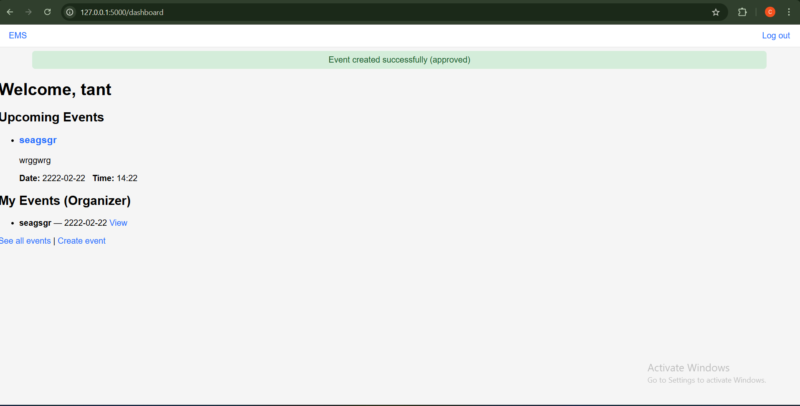
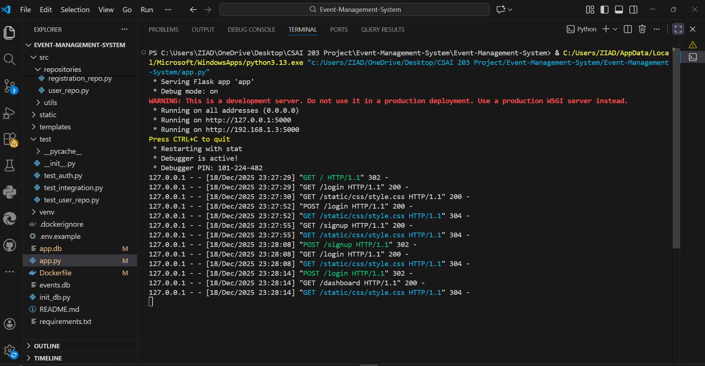

# Event Management System (EMS)

A web-based **Event Management System** developed using **Flask** following the **MVC architecture**.
The system allows users to register, login, browse events, register for events, and submit feedback.

---

## 📌 Features

- User Authentication (Signup / Login / Logout)
- Event Management (Create, View, Edit Events)
- Event Registration
- Feedback Submission
- MVC Architecture
- Repository Design Pattern
- Unit Testing
- Docker Support

---

## 🛠️ Technologies Used

- Backend: Python, Flask
- Frontend: HTML, CSS, Jinja2
- Database: SQLite
- Testing: unittest
- Containerization: Docker
- Version Control: Git & GitHub

---

## 🗂️ Project Structure

Event-Management-System/
│
├── src/
│ ├── controllers/
│ ├── repositories/
│ └── utils/
│
├── templates/
├── static/
├── test/
│
├── app.py
├── Dockerfile
└── README.md

---

---

## How to Run the Project Locally

### Create Virtual Environment
python -m venv venv

### Activate Virtual Environment

Windows:
venv\Scripts\activate

Mac / Linux:
source venv/bin/activate

### Install Dependencies
pip install -r requirements.txt

### Run the Application
python app.py

Open the browser at:
http://127.0.0.1:5000

---

## Run Using Docker
docker build -t ems-app .
docker run -p 5000:5000 ems-app

Then open:
http://localhost:5000

---

## Running Tests
python -m unittest discover test

---

## Architecture & Design Patterns

- MVC Architecture
- Repository Pattern
- Singleton Pattern (Database Connection)
- Factory Pattern (Application Creation)

---

## Team Contributions

- Zeyad:
zeyad was mainly responsible for the core backend and system foundation throughout the project.
He implemented the authentication functionality, including login and signup, along with the required controllers and repositories.
He also worked on the base layout and user interface styling, including the base template and CSS files.
In addition, eyad handled feedback functionality, database connection logic, security utilities, and application configuration files.
He implemented the main application setup, database initialization, and utility modules.
eyad was also responsible for writing multiple unit tests, preparing the Dockerfile, initializing the database, managing dependencies, and creating the final README file.

- Sara:
Sara worked mainly on event registration functionality and testing.
She implemented the event registration logic, including its controller and repository.
Sara also worked on the event details page and ensured correct interaction between the frontend and backend.
In Phase 5, she focused on writing unit tests related to registration and other system components.
Additionally, she prepared the testing report documenting the testing process and results.

- Retaj:
Retaj was responsible for event management features and documentation.
She implemented event-related functionalities, including event creation, editing, listing, and organizer-specific views.
Retaj also worked on the main dashboard and multiple event-related pages.
In addition to development tasks, she handled all documentation work, including User Documentation, Technical Documentation, and the Phase 5 Report.
She also prepared the final presentation slides and organized the demo flow for the project.

---

## Screenshots

Login Page  

Dashboard  

Event Details  

Feedback Page  

Docker Running  

---

## Documentation

All project documentation is available in the deliverables folders.

---

## Demo

1. User signs up
2. User logs in
3. Dashboard is displayed
4. User registers for an event
5. User submits feedback
6. Application runs using Docker

---

## Course Information

CSAI 203 – Software Engineering  
Phase 5 – Final Submission

---

## Notes

This project was developed for educational purposes.

